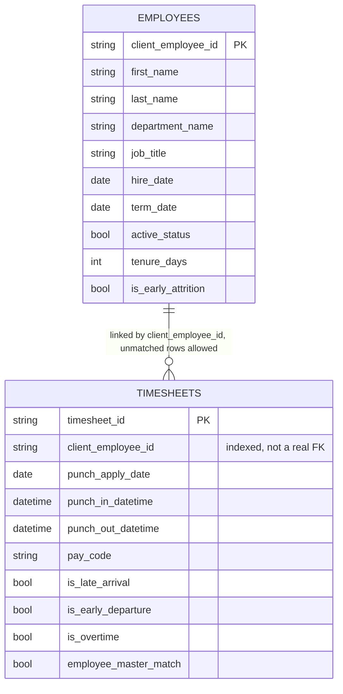

# Employee Timesheet Analytics

## Explaining the Project

Leapfrog gave me two datasets, employee records and timesheet punches, as part of a data engineering assignment. The brief was to take that raw data all the way through to something usable: a clean relational database, a REST API on top of it, business KPIs written in SQL, a few visualizations, and an automated pipeline holding the whole thing together. Nothing about the data was particularly clean going in. The timesheet files overlap each other, some employee IDs on timesheet rows do not exist anywhere in the employee master file, and pay codes are sometimes packed together in a single field.

## Approach

I broke the work into stages instead of trying to build everything at once. First get the raw files into a proper medallion pipeline (Bronze, Silver, Gold) so the data is trustworthy before anything else touches it. Then write the SQL analytics against the cleaned Gold tables. Then build a small local database and API that could serve that same data outside of Databricks. Then wire in authentication, orchestration, and the remaining pieces once the core was working. Doing it in that order meant that by the time I was building the API, I already knew exactly what the data looked like and where its rough edges were, instead of discovering them halfway through building endpoints.

## Tech stack:

* Databricks, PySpark and Delta Lake for the Bronze, Silver and Gold layers
* Spark SQL for the KPI queries
* Databricks Workflows for orchestrating the notebooks
* Python, FastAPI and SQLAlchemy for the API
* SQLite as the local database
* JWT (pyjwt) and bcrypt for authentication
* pandas and s3fs for the local data loading step, with MinIO used to test the S3 path
* A Databricks dashboard for the visualizations

## Challenges faced:

**1. Getting the API to actually talk to the database and recognize a login.** When I started on the CRUD endpoints, wiring FastAPI to the SQLite database and then getting the authentication token recognized on the protected routes was not as straightforward as I expected. It took a bit of trial and error to understand how a bearer token needed to flow from the login response into the Authorization header on every following request, and to get the SQLAlchemy session set up so the routes were not fighting over connections.

**2. Large files and GitHub.** Once I had the Silver CSVs ready to commit alongside the code, I pushed and GitHub rejected it, the timesheet exports were over its 100MB per file limit. I had already made a couple of commits on top of that by the time I noticed, so I ended up having to reset those commits, compress the offending files, and redo the commit properly rather than just patching forward. It cost some time but it was a useful reminder to check file sizes before committing large data exports, not after.

**3. Timesheet date and timestamp columns.** Getting the punch in and punch out columns to parse correctly into proper date and timestamp types in Spark took much longer than I expected. One malformed row was enough to throw off type inference for the whole batch, which meant the notebook would fail outright instead of just producing a bad row. I had to go back to how Bronze was structured and add a quarantine step that pulls out the malformed rows (mainly ones missing a pay code alongside broken timing fields) before they ever reach Silver, tagging each one with a reason, so the rest of the pipeline could run cleanly and nothing was silently dropped without a trace.

## Tech Stack I used:

**1. Databricks for the pipeline.** I chose Databricks for transformation because I already know PySpark and Databricks well, and with timesheet volumes in the hundreds of thousands of rows, Spark was a reasonable fit for the transformation work anyway.

**2. SQLite over Postgres for the API.** I did not want to add the overhead of running and configuring a separate database server for what is essentially a local demo of the API layer. SQLite is a single file, needs no setup, and is enough to prove the API works end to end. I put SQLAlchemy between the API and the database specifically so that swapping SQLite for Postgres later is a one line change to the connection string in `db/session.py`, not a rewrite of the models or the routes, in case this ever needs to run somewhere with concurrent write load.

**3. No foreign key between employees and timesheets.** A number of timesheet rows reference employee IDs that are not in the employee master file. The Gold layer keeps these rows instead of dropping them, because dropping them would understate hours worked and hide a real data quality signal instead of surfacing it. A hard foreign key would reject every one of those rows the moment you tried to load them, so `timesheets.client_employee_id` is indexed for fast lookups but is not a real foreign key, and a boolean column, `employee_master_match`, marks which rows do and do not line up with a known employee.

**4. Dropping some Silver columns from the API database.** The Silver CSVs carry pipeline bookkeeping fields like `_source_file` and `_ingested_at`, and personal fields like date of birth, home address, phone number and email. None of that is something the API needs to serve, so both categories were left out of the `employees` and `timesheets` tables. Everything else, all of the actual business columns, was kept as is.

**5. Keeping pay code as one flat column.** Silver produces a proper pay code bridge table and a pay code dimension table for cases where more than one code applies to a single punch. Nothing the API or the required KPIs need actually requires that breakdown, they need the flags already derived from it (`has_overtime_pay_code`, `has_leave_pay_code`), so I left those two extra tables out of the API database rather than adding joins for a feature nothing was using.

**6. JWT with two hardcoded accounts instead of a real user system.** The assignment asks for authentication and authorization, not a full account management system, so I built exactly that: one admin account that can read and write, one viewer account that can only read. Passwords are hashed with bcrypt rather than kept in plain text, and tokens are signed with pyjwt, both small and well tested libraries rather than anything I wrote myself. If this ever needed real accounts, those two hardcoded entries in `auth.py` would become a database table and the rest of the API would barely need to change, since every route only cares about the role coming back from the token.

**7. Databricks Workflows instead of Luigi or Airflow.** Every notebook in this project depends on Spark and Unity Catalog, so none of them can run outside Databricks. Bringing in a separate orchestration tool locally would have meant writing code just to remotely trigger notebooks over an API and managing credentials for that, when Databricks already does this natively. The job defines explicit task dependencies (bronze ingestion, then silver employee, then silver timesheet, branching into the two Gold notebooks, converging at the data quality checks), each task has retries configured, and Databricks' repair run feature lets you rerun just the failed task and whatever depends on it instead of the whole pipeline. The exported job definition is checked into `orchestration/etl_job.yml` so the DAG is visible in the repository itself.

**8. Local files and MinIO both supported, at the loader level.** The assignment asks for the option to load from local files or S3 compatible storage. The Databricks notebooks already own the real extract step against a Databricks Volume, and reworking that for S3 would mean touching Spark cluster configuration for no real benefit. The place this actually matters is the local loader that fills the SQLite database, so that is where the source is configurable. Set `DATA_SOURCE` to `local` and it reads from the `data/silver` folder, set it to `s3` and it reads the identical files from a bucket instead, using pandas and s3fs. I tested this against a real local MinIO server rather than leaving it as untested code.

## Database schema

Two tables, `employees` and `timesheets`, both living in a single SQLite file (`api/app.db`), created and populated by `api/db/load_data.py`.



### employees

Primary key is `client_employee_id`. Full column list (28 columns): identity fields (`first_name`, `last_name`, `preferred_name`, `full_name`), job fields (`job_code`, `job_title`, `job_start_date`, `department_id`, `department_code`, `department_name`, `organization_name`), manager fields (`manager_employee_id`, `manager_exists`), employment fields (`fte_status`, `scheduled_weekly_hour`, `hire_date`, `recent_hire_date`, `anniversary_date`, `term_date`, `active_status`, `employment_status`, `termination_reason`), and tenure fields already computed upstream in Silver (`tenure_days`, `tenure_years`, `tenure_end_date`, `days_to_termination`, `is_early_attrition`).

`manager_employee_id` is indexed but also not a foreign key, since `manager_exists` shows some managers referenced here are not themselves present as employee rows.

### timesheets

Primary key is `timesheet_id` (a hash generated in Silver from the natural key of employee, punch date, and punch in and out times). 38 columns in total: identifiers and timing (`client_employee_id`, `employee_master_match`, `punch_apply_date`, `punch_in_datetime`, `punch_out_datetime`, `scheduled_start_datetime`, `scheduled_end_datetime`), department fields (`department_id`, `department_name`, `home_department_id`, `home_department_name`), pay code fields (`pay_code`, `pay_code_count`, `has_multiple_pay_codes`, `has_overtime_pay_code`, `has_leave_pay_code`, `punch_in_comment`, `punch_out_comment`), duration fields (`hours_worked`, `actual_duration_minutes`, `actual_duration_hours`, `scheduled_duration_minutes`, `scheduled_duration_hours`, `hours_worked_vs_punch_variance`, `source_duplicate_count`, `is_schedulable`), and the attendance flags computed with a five minute grace period (`arrival_variance_minutes`, `late_arrival_minutes`, `is_late_arrival`, `departure_variance_minutes`, `early_departure_minutes`, `is_early_departure`, `schedule_variance_minutes`, `overtime_minutes`, `overtime_hours`, `is_overtime`, `is_excessive_duration`).

`client_employee_id` and `punch_apply_date` are indexed, since those are exactly the two filters the API exposes on the timesheets endpoints.

## Setup

You need Python 3.11 or newer, and the CSV exports, already included in this repository under `data/bronze` and `data/silver`, with the large timesheet files stored as gzip.

```bash
git clone <this repo>
cd employee_timesheet_analysis/api

python3 -m venv .venv
source .venv/bin/activate
pip install -r requirements.txt
```

That installs FastAPI, SQLAlchemy, pandas, the JWT and password hashing libraries, and s3fs for the optional S3 loading path.

## Usage

### Building the local database

```bash
python -m db.load_data
```

This creates `api/app.db` if it does not exist, wipes both tables, and reloads them from `data/silver/employee.csv` and `data/silver/timesheet.csv.gz`. Safe to run again any time the source data changes.

To load from MinIO or S3 instead, set these before running the same command:

```bash
export DATA_SOURCE=s3
export S3_BUCKET=your-bucket
export S3_PREFIX=silver
export S3_ENDPOINT_URL=http://localhost:9000
export S3_ACCESS_KEY=your-key
export S3_SECRET_KEY=your-secret
```

### Running the API

```bash
uvicorn main:app --reload
```

Open `http://127.0.0.1:8000/docs` for the interactive Swagger page, or `http://127.0.0.1:8000/redoc` for a read only reference view.

Log in first through `POST /login` with one of two demo accounts:

* `admin` / `admin123`, full read and write access
* `viewer` / `viewer123`, read only

Copy the `access_token` from the response, click Authorize on the docs page, and paste it in. Every endpoint besides `/health` and `/login` requires this.

Available endpoints:

* `POST /employees`, `GET /employees`, `GET /employees/{employee_id}`, `PUT /employees/{employee_id}`, `DELETE /employees/{employee_id}` (write operations need the admin role)
* `GET /timesheets`, filterable by `employee_id`, `start_date`, `end_date`, paginated with `limit` and `offset`
* `GET /timesheets/{employee_id}`, the same date filters, scoped to one employee

### Running the ETL pipeline

The Databricks Workflow `employee_timesheet_etl` runs all six notebooks in order (bronze ingestion, then silver employee, then silver timesheet, branching into the two Gold notebooks, converging at the data quality checks, with the SQL analytics task running alongside). Trigger it manually from Jobs and Pipelines in the Databricks workspace, or add a schedule from the same screen for it to run unattended. The exported job definition is in `orchestration/etl_job.yml` for reference.

### Viewing the analytics

The SQL KPI queries live in `notebooks/07_sql_analytics.sql`. The dashboard, with rolling average working hours, an attendance exception breakdown, and a Genie chat panel for ad hoc questions, is published in the Databricks workspace under Dashboards.

Dashboard can be viewed at link: `https://dbc-65d19f0c-b0e3.cloud.databricks.com/dashboardsv3/01f1b128a66a15ecbfcffecd22e00ff4/published?o=7474658968581301`
